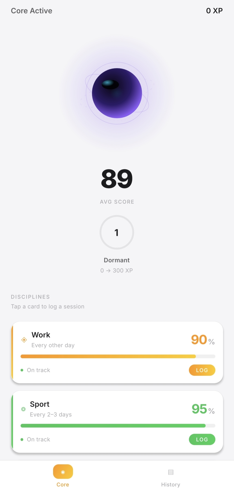

# Inertial Productivity Engine

A cross-platform productivity and momentum tracking application built with React Native and Expo. The application abandons passive time-based tracking in favor of an event-driven combo progression engine and mathematical decay models.

<p align="center">
  
</p>

---

## Technical Overview

The Inertial Productivity Engine is engineered to maintain consistency across physical and cognitive disciplines by calculating current momentum using deterministic decay formulas. User interaction is centered around logging completed discipline sessions, which updates local scores and feeds into a central visual artifact—the **Dark Matter Energy Core**.

### Core Architecture

- **Framework**: React Native with Expo (SDK 57)
- **State Management**: Zustand
- **Persistence**: AsyncStorage (offline-first, event-sourced snapshot pattern)
- **Animation & Gesture**: React Native Reanimated 4 and Gesture Handler
- **Typography**: Inter (Google Fonts)
- **Design Language**: Apple Premium Light with Glassmorphic Surfaces

---

## System Mechanics

### 1. Mathematical Decay & Action Gain Models

Momentum scores across all disciplines range from 0 to 100%. Decay is evaluated on demand upon app launch or foreground rehydration based on elapsed calendar days since the last log.

#### Sport
- **Rhythm Target**: Every 2 to 3 days
- **Decay Curve**: Accelerating non-linear subtraction
  - Day 0: `Score = Last_Score`
  - Day 1: `Score = Last_Score - 5`
  - Day 2: `Score = Last_Score - 15`
  - Day 3: `Score = Last_Score - 30` (Signal threshold to maintain rhythm)
  - Day 4: `Score = Last_Score - 50`
  - Day 5: `Score = Last_Score - 75`
  - Day 6+: `Score = 0`
- **Action Gain**: `New_Score = Math.min(100, Decayed_Score + 80)`

#### Work
- **Rhythm Target**: Every other day
- **Input**: Efficiency Rating (E in 1..5)
- **Decay Curve**: Accelerating subtraction
  - Day 0: `Score = Last_Score`
  - Day 1: `Score = Last_Score - 10`
  - Day 2: `Score = Last_Score - 30`
  - Day 3: `Score = Last_Score - 60`
  - Day 4+: `Score = 0`
- **Action Gain**: `Gain = 10 + (E * 10)` -> `New_Score = Math.min(100, Decayed_Score + Gain)`

#### Language & Speech
- **Rhythm Target**: Every 3 days
- **Decay Curve**: Linear decay (`Score = Math.max(0, Last_Score - (Days * 10))`)
- **Action Gain**: Fixed gain (`New_Score = Math.min(100, Decayed_Score + 40)`)

#### Posture & Ergonomics
- **Rhythm Target**: Daily micro-task
- **Input**: Quality Rating (R in 1..5)
- **Decay Curve**: Linear decay (`Score = Math.max(0, Last_Score - (Days * 20))`)
- **Action Gain**: `Gain = R * 15` -> `New_Score = Math.min(100, Decayed_Score + Gain)`

---

### 2. Event-Based Combo Engine

Experience points (XP) and Core leveling are determined exclusively when a discipline session is logged. The system analyzes the sequence of the **last 3 logged events** for that category:

- **S-Rank (Perfect Rhythm)**: All 3 consecutive scores are >= 90%. **+300 XP**
- **A-Rank (Maintenance)**: All 3 consecutive scores are >= 70%. **+100 XP**
- **Recovery Rank (The Comeback)**: Scores strictly increase by at least 15 points per step. **+250 XP**
- **C-Rank (Degradation)**: Non-qualifying sequences or stagnant scores. **+0 XP**

---

### 3. Metagame: Dark Matter Energy Core

The top dashboard features an SVG visualizer representing aggregate discipline health:

- **Structure**: Obsidian nucleus (`#0B0813`), pulsing indigo (`#2D1B69`), plasma purple (`#8B5CF6`), and ethereal cyan (`#06B6D4`) gradient layers with multi-axis rotating nebula rings.
- **Physics**: Continuous breathing loop governed by spring physics (`stiffness: 300, damping: 25`).
- **Low Energy State**: If the aggregate score drops below 50%, the Core desaturates into a dormant obsidian state until an S-Rank or Recovery combo is logged.

---

## Directory Structure

```
src/
├── components/       # ActionDrawer, CategoryCard, ComboToast, CoreVisualizer, FluidProgressBar, LevelBadge, RatingInput
├── constants/        # Theme tokens (colors, shadows, typography) and category metadata
├── engine/           # Math formulas, combo analyzer, level scaling, and UUID helpers
├── navigation/       # Bottom tab navigator configuration
├── screens/          # DashboardScreen and HistoryScreen
└── store/            # Zustand state management and AsyncStorage persistence layer
```

---

## Getting Started

### Prerequisites

- Node.js (v18+)
- npm or yarn
- Expo Go app on iOS/Android or an Android Emulator / iOS Simulator

### Installation

1. Clone the repository:
   ```bash
   git clone https://github.com/TarasZinchenko/Inertial-Productivity-App.git
   cd Inertial-Productivity-App
   ```

2. Install dependencies:
   ```bash
   npm install
   ```

3. Start the development server:
   ```bash
   npx expo start
   ```

---

## Building Standalone Packages

To generate a direct standalone Android APK using Expo Application Services (EAS):

```bash
# 1. Install EAS CLI
npm install -g eas-cli

# 2. Authenticate
eas login

# 3. Build Preview APK
eas build -p android --profile preview
```

---

## License

This project is open-source and available under the [MIT License](LICENSE).
